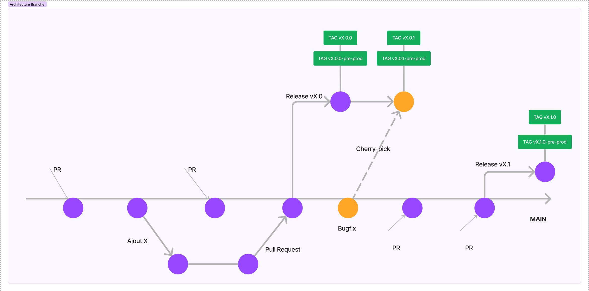

# Scaleway

## Frontend

Static website in Object Storage, to serve the front end via the Scaleway CDN (Content Delivery Network).

## Backend

TypeScript Docker application in serverless mode. The last image is stored in the Scaleway registry and overwritten with every deployment.

## Database

Postgresql managed by scaleway, exposed on the Internet and password-protected only (thanks to the impossibility of putting serverless and a managed DB on a private network in Scaleway).

## Flux vidéo & Authentification

Standard compute instances required because multiple ports are used (not available in serverless).

# Branches

Diagram of our trunk-based gitflow (ideal)

Currently, there are no release branches. The main branch is deployed with each commit.

# CI/CD

