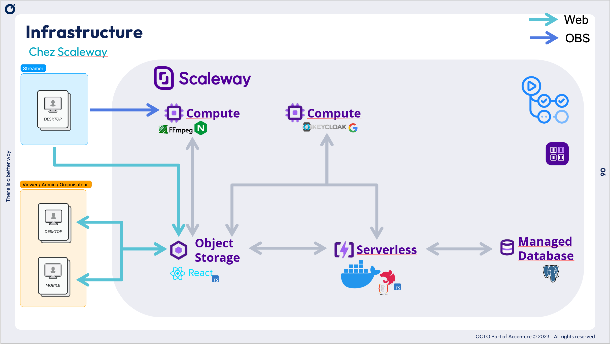
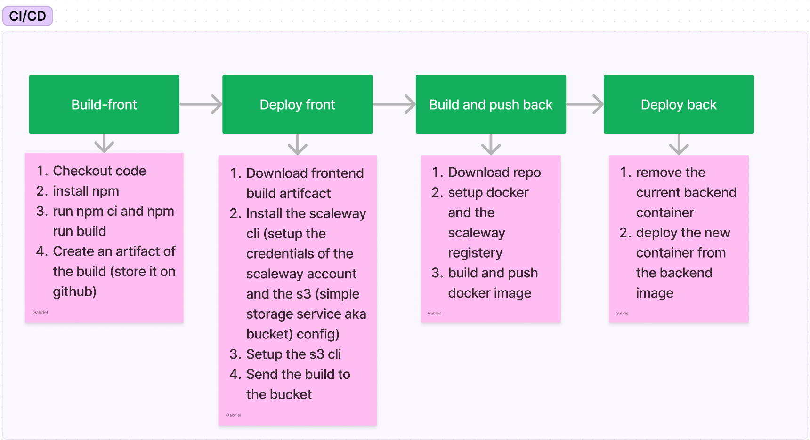

# Introduction to the Ochocast Opensource project
Ochocast is a multitrack streaming application for events. It is divided into two: video storage and live streaming. 

The storage part is currently a work in progress and the streaming part is currently left for later.

This application is the work of Octo and Epita students in the SIGL specialty.

## Installation
Please refer to this [page](./02-installation.md) to make your first steps to contributing to the project

## Scaleway infrastructure

## Frontend

Static website in Object Storage, to serve the front end via the Scaleway CDN (Content Delivery Network).

See more on this [here](./02-tools/01-Front-end.md).

## Backend

TypeScript Docker application in serverless mode. The last image is stored in the Scaleway registry and overwritten with every deployment.

See more on this [here](./02-tools/02-Backend-Architecture.md).

## Database

Postgresql managed by scaleway, exposed on the Internet and password-protected only (thanks to the impossibility of putting serverless and a managed DB on a private network in Scaleway).
See more on this [here](./02-tools/03-stockage-s3.md).

## Stream video & Authentification

Standard compute instances required because multiple ports are used (not available in serverless).

See more about authentification [here](./02-tools/04-Authentification.md).

See more about stream video on this ../rtmpServer/README.md for RTMP Server, \
Or on this ../webSocketServer/README.md for websocket Server.

# Branches

Diagram of our trunk-based gitflow (ideal)

Currently, there are no release branches. The main branch is deployed with each commit.

# CI/CD

See more on this [here](./02-tools/05-CI-CD.md)
