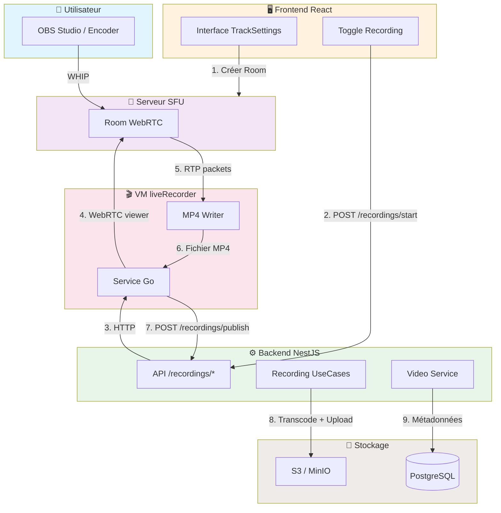

# Enregistrement des Lives

OchoCast permet d'enregistrer automatiquement vos sessions de streaming en direct pour les publier ensuite en tant que vidéos à la demande.

## Architecture du Système

Le système d'enregistrement fonctionne avec plusieurs composants qui communiquent entre eux.

:::tip Schéma interactif
Copiez le code ci-dessous dans [Mermaid Live Editor](https://mermaid.live) pour visualiser le schéma d'architecture :


:::

### Flux détaillé

| Étape | Action | Description |
|-------|--------|-------------|
| 1 | Créer la Room | Le frontend crée une room SFU et récupère `room_id` + `key` |
| 2 | Démarrer l'enregistrement | L'utilisateur active le toggle, le frontend appelle `/recordings/start` |
| 3 | Notification VM | Le backend contacte la VM liveRecorder via HTTP |
| 4 | Connexion WebRTC | Le recorder se connecte au SFU en mode "viewer only" |
| 5 | Réception des flux | Le recorder reçoit les packets RTP (audio + vidéo) |
| 6 | Écriture MP4 | Les flux sont synchronisés et écrits dans un fichier MP4 |
| 7 | Publication | À l'arrêt, le recorder envoie le MP4 au backend |
| 8 | Traitement | Le backend transcode et upload vers S3 |
| 9 | Finalisation | La vidéo est créée en base avec les métadonnées du track |

---

## Prérequis

Avant de pouvoir utiliser l'enregistrement, plusieurs composants doivent être déployés et configurés :

### Infrastructure requise

| Composant | Description | Variable d'environnement |
|-----------|-------------|--------------------------|
| **VM liveRecorder** | Service Go qui capture les flux | `RECORDING_VM_URL` (backend) |
| **Serveur SFU** | Gère les connexions WebRTC | `REACT_APP_SFU_CONTROL_PLANE_URL` (frontend) |
| **Stockage (MinIO/S3)** | Stocke les vidéos finales | `STOCK_*` (backend) |
| **Keycloak** | Authentification pour la publication auto | Variables Keycloak (VM) |

### Configuration Backend

Dans le fichier `.env` du backend :

```env
# URL de la VM d'enregistrement
RECORDING_VM_URL=<url-vm-liverecorder>
```

### Configuration VM liveRecorder

Dans le fichier `.env` de la VM :

```env
# URL du backend pour la publication automatique
BACKEND_PUBLIC_URL=<url-backend>

# Authentification Keycloak
KEYCLOAK_TOKEN_URL=<url-keycloak>/realms/<realm>/protocol/openid-connect/token
KEYCLOAK_CLIENT_ID=<client-id>
KEYCLOAK_CLIENT_SECRET=<client-secret>

# Utilisateur technique pour la publication
RECORDING_USER_USERNAME=<username>
RECORDING_USER_PASSWORD=<password>
```

:::warning Utilisateur technique
Créez un utilisateur dédié dans Keycloak avec les droits nécessaires pour publier des vidéos. Ne pas utiliser un compte administrateur.
:::

---

## Comment activer l'enregistrement

### Étape 1 : Créer un Track (événement live)

1. Connectez-vous à OchoCast
2. Accédez à la page de création d'événement
3. Remplissez les informations du track (titre, description, speakers, tags)
4. Sauvegardez le track

### Étape 2 : Démarrer le live

1. Accédez aux paramètres du track (`/track/{id}/settings`)
2. Cliquez sur **"Démarrer le live OBS"**
3. Une URL WHIP s'affiche - copiez-la dans OBS Studio
4. Configurez OBS et lancez le streaming

### Étape 3 : Activer l'enregistrement

Une fois le live démarré :

1. Le toggle **"Activer l'enregistrement"** devient disponible
2. Activez le toggle
3. Un toast de confirmation s'affiche : "Enregistrement démarré"
4. L'enregistrement commence immédiatement

:::info Le live doit être actif
Le toggle d'enregistrement n'est activable qu'après avoir démarré le live. Un message vous indiquera : "Démarrez d'abord le live avant d'activer l'enregistrement".
:::

### Étape 4 : Arrêter l'enregistrement

Pour arrêter l'enregistrement :

1. Désactivez le toggle **"Activer l'enregistrement"**
2. Un toast confirme : "Enregistrement arrêté"
3. La vidéo est automatiquement publiée

:::warning Publication automatique
L'arrêt de l'enregistrement déclenche automatiquement la publication de la vidéo. Assurez-vous d'avoir terminé votre session avant de désactiver le toggle.
:::

---

## Où retrouver les vidéos enregistrées

Les vidéos enregistrées sont automatiquement publiées dans la section **Vidéos** d'OchoCast.

### Métadonnées héritées

La vidéo publiée hérite automatiquement des informations du track :

| Champ | Source |
|-------|--------|
| Titre | Titre du track |
| Description | Description du track |
| Speakers | Intervenants du track |
| Tags | Tags du track |
| Miniature | Générée automatiquement |

### Accès aux vidéos

1. **Page d'accueil** : Les vidéos récentes apparaissent dans la section "Dernières vidéos"
2. **Section Vidéos** : Toutes les vidéos sont listées dans `/videos`
3. **Profil utilisateur** : Retrouvez vos vidéos dans votre espace personnel

### Traitement de la vidéo

Après la publication, la vidéo passe par plusieurs étapes :

1. **Upload** : Le fichier MP4 est envoyé au backend
2. **Transcodage** : La vidéo est convertie en différentes qualités (HLS)
3. **Miniature** : Une vignette est générée automatiquement
4. **Stockage** : Les fichiers sont uploadés vers S3
5. **Disponibilité** : La vidéo devient accessible aux utilisateurs

:::note Délai de traitement
Le traitement peut prendre quelques minutes selon la durée de l'enregistrement. La vidéo apparaîtra dans la liste une fois le processus terminé.
:::

---

## Dépannage

### Le toggle d'enregistrement est grisé

**Cause** : Le live n'est pas encore démarré.

**Solution** : Cliquez d'abord sur "Démarrer le live OBS" et attendez que la room SFU soit créée.

### Message "Erreur lors du démarrage de l'enregistrement"

**Causes possibles** :
- La VM liveRecorder n'est pas accessible
- Problème de connexion réseau

**Solutions** :
1. Vérifiez que la VM liveRecorder est en cours d'exécution
2. Vérifiez la variable `RECORDING_VM_URL` dans le backend
3. Consultez les logs de la VM

### La vidéo n'apparaît pas après l'arrêt

**Causes possibles** :
- Le transcodage est en cours
- Échec de la publication automatique

**Solutions** :
1. Attendez quelques minutes (le transcodage prend du temps)
2. Vérifiez les logs du backend pour les erreurs
3. Vérifiez la configuration Keycloak de la VM

### La vidéo est désynchronisée (audio/vidéo)

**Cause** : Problème lors de la capture des flux RTP.

**Solutions** :
1. Vérifiez la stabilité de la connexion réseau
2. Réduisez la qualité du stream OBS
3. Consultez les logs de la VM liveRecorder

---

## Bonnes pratiques

### Avant l'enregistrement

- Testez votre configuration OBS avant le live officiel
- Vérifiez que tous les services sont opérationnels
- Préparez les métadonnées du track (titre, description, tags)

### Pendant l'enregistrement

- Surveillez les indicateurs de streaming dans OBS
- Gardez une connexion réseau stable
- Évitez de rafraîchir la page des paramètres du track

### Après l'enregistrement

- Attendez le toast de confirmation avant de fermer la page
- Vérifiez que la vidéo apparaît dans la section Vidéos
- Modifiez les métadonnées si nécessaire depuis la page de la vidéo
