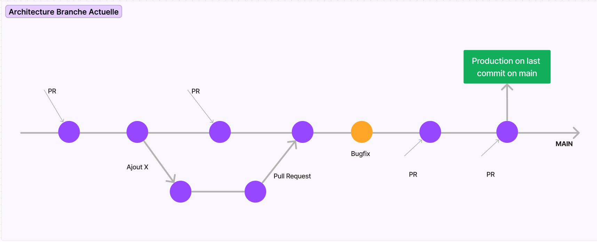

# Introduction

Ochocast is a multi-channel streaming application dedicated to live or on-demand events. It consists of two main technical components:

- The "video storage" part, which allows managing, hosting, and broadcasting recorded content.
- The "live streaming" part, planned for a future version, which will enable live stream management.

## Project Origin

Ochocast was born as part of an educational project from the SIGL (Information Systems and Software Engineering) program at EPITA. It is part of an experimentation and collaboration approach between students, supervisors, and professionals.

This project was initiated in connection with the PAE (In-depth and Experimentation Project), an educational format at EPITA aimed at confronting students with concrete business challenges.

## Octo: A Committed Sponsor

Octo Technology supports this project as part of its commitment to Open Source, knowledge sharing, and technological innovation. The company provided mentorship, technical reviews, and field experience feedback throughout the development.

## An Open Source Philosophy

Ochocast is designed as a free and open application to:

- Not be at the core of Octo's business, making external development more relevant and avoiding the need to keep it internal.
- Contribute to the Open Source community, thus bringing shared added value and a collaborative spirit.
- Benefit from the community spirit, with fewer bugs and vulnerabilities thanks to code reviews (external PRs) that ensure continuous application quality.

This Git repository and documentation aim to transmit the project's memory, facilitate its maintenance, and allow its evolution over time.

## Installation

Please consult this [page](documentation/02-installation.md) to get started and contribute to the project.

## Infrastructure Scaleway

## Frontend

OchoCast is a static website stored in Object Storage, allowing the front-end to be served via Scaleway's CDN (Content Delivery Network).

Learn more about this [here](./02-tools/01-Front-end.md).

## Backend

OchoCast is a Docker application in TypeScript that runs in serverless mode. The latest image is stored in the Scaleway registry and is overwritten with each deployment.

Learn more about this [here](./02-tools/02-Backend-Architecture.md).

## Database

OchoCast uses a PostgreSQL DB managed by Scaleway, exposed on the Internet and protected only by password (due to the impossibility of connecting a serverless service and a managed database on a private network at Scaleway).

Learn more about this [here](./02-tools/03-stockage-s3.md).

## Video Streaming & Authentication

Standard compute instances are required, as multiple ports are used (which is not possible in serverless mode).

Learn more about authentication [here](./02-tools/04-Authentification.md).

Learn more about video streaming:
- Check the [file](./03-tutorial-extras/03-rtmpServer.md) for the RTMP server
- Check the [file](./03-tutorial-extras/04-WebSocketServer.md) for the WebSocket server

# Branches

Diagram of our trunk-based Git flow (ideal).

Currently, there are no release branches. The main branch is deployed with each commit.

# CI/CD

Learn more about this [here](./02-tools/05-CI-CD.md).
