# Administration Panel Guide

The OchoCast administration panel allows administrators to customize the application's appearance in real-time without directly modifying the source code. This guide details each feature and its visual impact.

## Panel Access

**Access URL**: `/admin`

:::warning Required Rights
Only users with **administrator rights** can access this panel. Non-administrator users will be redirected to a 404 page.
:::

## Overview

The administration panel is organized into several sections:

1. **General Information** - Application name
2. **Theme Colors** - Main color palette
3. **Color Preview** - Preview of generated gradients
4. **Branding Images** - Custom logos and icons

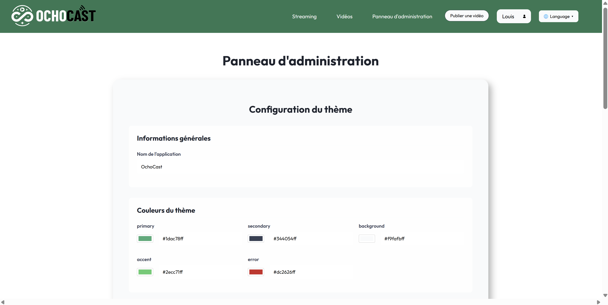
*Complete view of the administration panel with all sections*

---

## 1. General Information

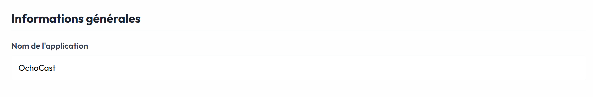
*Section to modify the application name*

### Application Name

**Field**: `Application Name`

**Description**: This field defines the name displayed throughout the application.

**Visible Effect**:
- Appears in the page title (browser tab)
- Displayed in the navigation bar
- Used in emails and notifications

**Example**:
```yaml
appName: "OchoCast"
```

**Where to see it**:
- Top left of the navigation bar
- In the browser tab
- On the login page

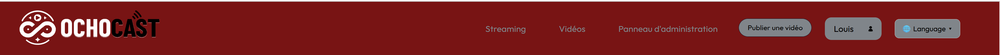
*Example of logo displayed in the navigation bar*

---

## 2. Theme Colors

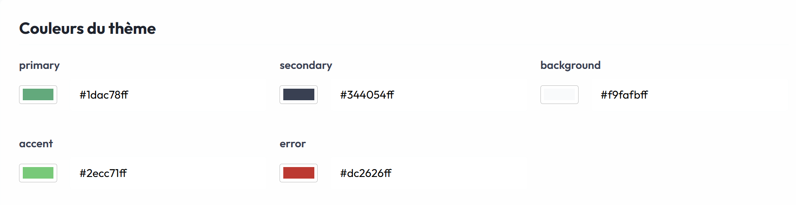
*The 5 color fields with their selectors*

The color system uses hexadecimal format with transparency (8 characters: `#RRGGBBAA`).

### 2.1 Primary Color

**Field**: `primary`

**Description**: The main color of the application, used for interactive elements and important accents.

**Visible Effect**:
- Primary buttons (login, save, validate)
- Clickable links
- Active navigation elements
- Progress bars
- Important icons

**Format**: `#1dac78ff` (green by default)

**Usage Example**:
- "Save Configuration" button in the admin panel
- "Login" button on the authentication page
- Links in the navigation bar

**Before/After color modification**:

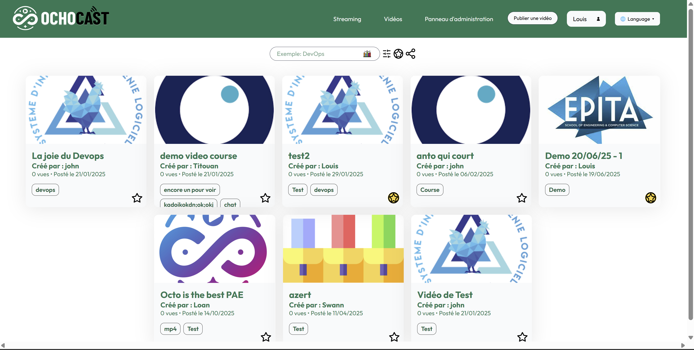
*Application with default colors*

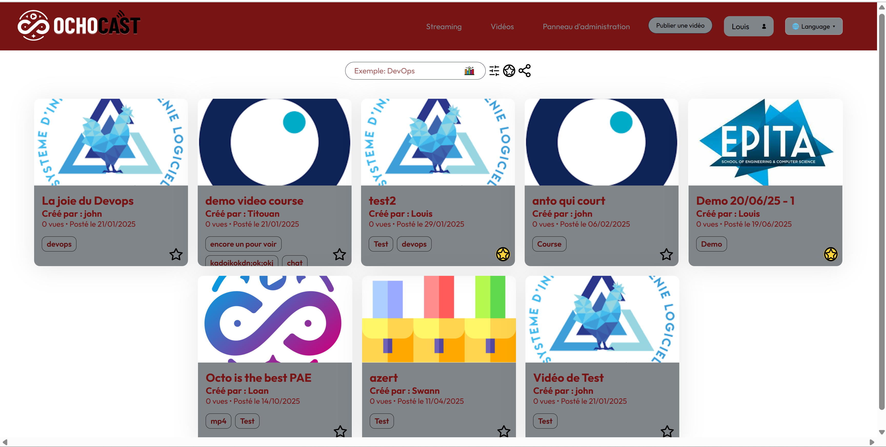
*Application with new customized colors*

**How to Modify**:
1. Click on the color picker (colored square)
2. Choose a color in the picker
3. OR directly enter a hexadecimal code in the text field

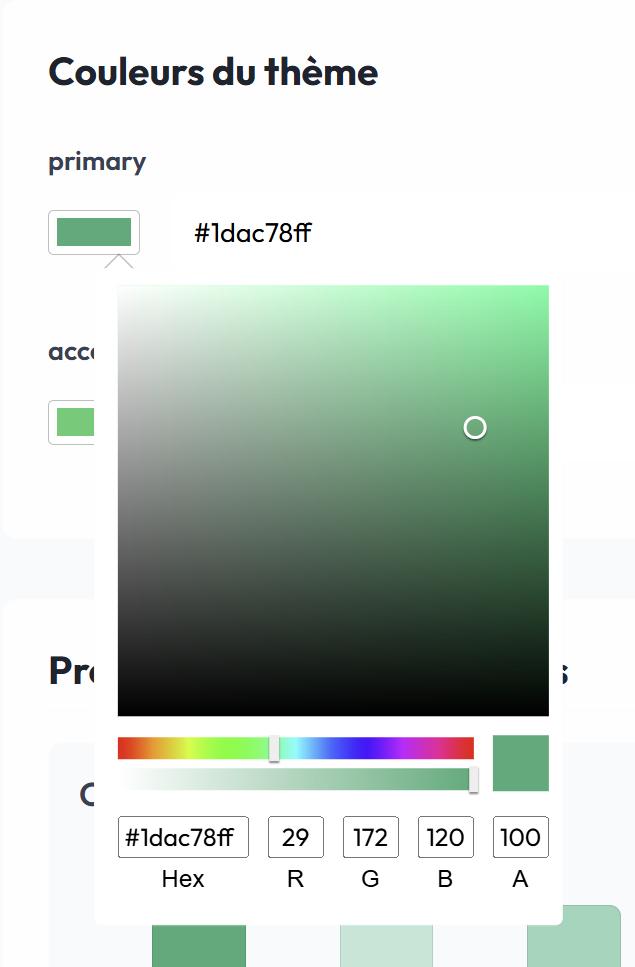
*Color picker opened to select a color*

### 2.2 Secondary Color

**Field**: `secondary`

**Description**: Color used for secondary texts and borders.

**Visible Effect**:
- Description texts
- Card borders
- Separators
- Form texts

**Format**: `#344054ff` (dark gray by default)

**Usage Example**:
- Description text under titles
- Form field borders
- Separation lines between sections

### 2.3 Background Color

**Field**: `background`

**Description**: Main background color of the application.

**Visible Effect**:
- Background of all pages
- Section backgrounds
- Spaces between cards

**Format**: `#f9fafbff` (very light gray by default)

**Usage Example**:
- Homepage background
- Administration panel background
- Video list background

### 2.4 Accent Color

**Field**: `accent`

**Description**: Color used to draw attention to specific elements.

**Visible Effect**:
- Notification badges
- Highlights
- Information alerts
- Highlighted elements

**Format**: `#2ecc71ff` (light green by default)

**Usage Example**:
- "New" badge on recent videos
- Success notifications
- Featured elements

### 2.5 Error Color

**Field**: `error`

**Description**: Color used for error messages and critical alerts.

**Visible Effect**:
- Error messages
- Invalid field borders
- Delete buttons
- Critical alerts

**Format**: `#dc2626ff` (red by default)

**Usage Example**:
- "Save error" message
- Red border around an incorrectly filled field
- "Delete" button in dangerous actions

---

## 3. Color Preview

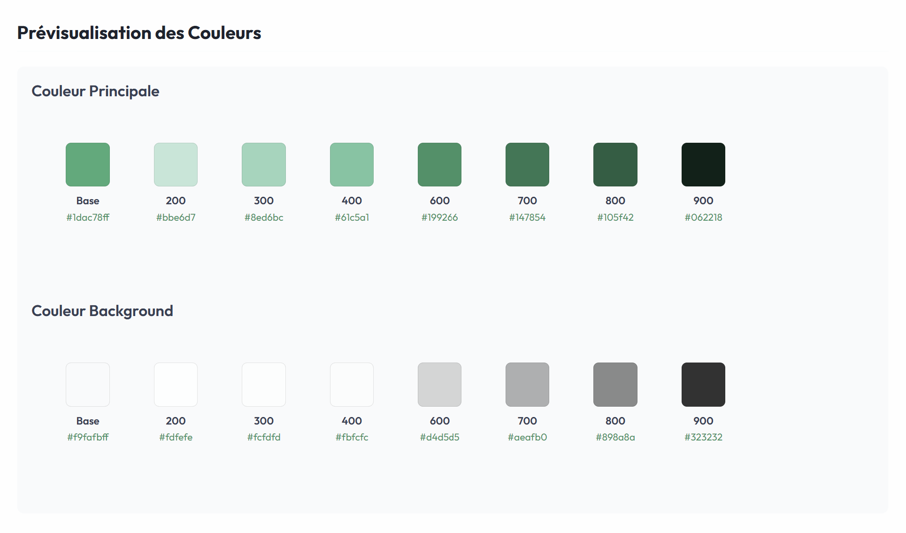
*Automatically generated color palettes (variants 50-900)*

This section automatically displays the **generated variants** from the base colors.

### 3.1 Gradient System

For each base color, the system generates **10 variants** (50, 100, 200, 300, 400, 500, 600, 700, 800, 900):

- **50-400**: Light variants (mixed with white)
- **500**: Exact base color
- **600-900**: Dark variants (mixed with black)

### 3.2 Primary Color Preview

**Section**: `Primary Color Preview`

**Display**:
- Complete palette of 10 primary color variants
- Hexadecimal code of each variant
- Real-time visual preview

**Generated CSS Variables**:
```css
--theme-color-50
--theme-color-100
--theme-color-200
--theme-color-300
--theme-color-400
--theme-color-500  /* Base color */
--theme-color-600
--theme-color-700
--theme-color-800
--theme-color-900
```

### 3.3 Background Color Preview

**Section**: `Background Color Preview`

**Display**:
- Complete palette of 10 background color variants
- Hexadecimal code of each variant
- Real-time visual preview

**Generated CSS Variables**:
```css
--bg-color-50
--bg-color-100
--bg-color-200
--bg-color-300
--bg-color-400
--bg-color-500  /* Base color */
--bg-color-600
--bg-color-700
--bg-color-800
--bg-color-900
```

---

## 4. Branding Images

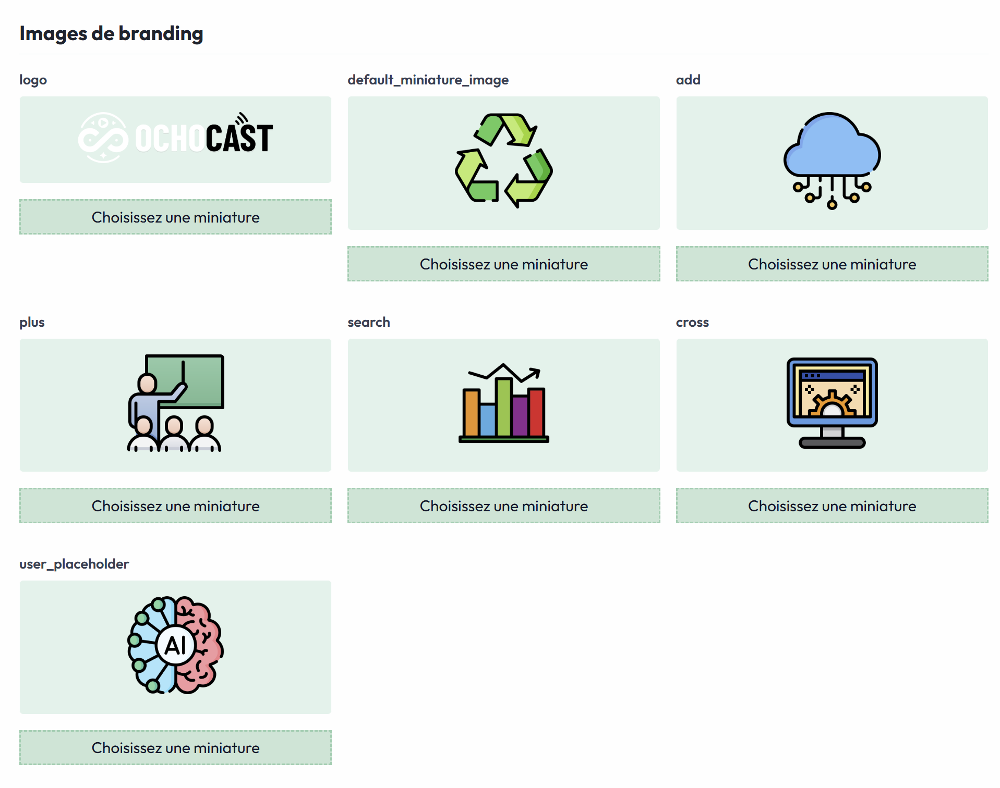
*List of customizable images with previews*

This section allows you to customize all images used in the application.

### 4.1 Main Logo

**Field**: `logo`

**Description**: Main application logo displayed in the navigation bar.

**Accepted Format**: SVG, PNG, JPG

**Recommended Dimensions**: 
- Width: 150-200px
- Height: 40-60px
- Format: SVG (for better quality)

**Visible Effect**:
- Displayed at the top left of the navigation bar
- Visible on all pages
- Used as favicon

**How to Modify**:
1. Click "Choose file" under the current preview
2. Select your new logo
3. Preview displays immediately
4. Click "Save Configuration" to apply

### 4.2 Default Thumbnail Image

**Field**: `default_miniature_image`

**Description**: Image used as default thumbnail for videos without custom thumbnail.

**Accepted Format**: PNG, JPG, WEBP

**Recommended Dimensions**: 
- Width: 1280px
- Height: 720px
- Ratio: 16:9

**Visible Effect**:
- Displayed on video cards without thumbnail
- Used in video lists
- Visible on the homepage

**Usage Example**:
- New uploaded video without thumbnail
- Video being processed
- Placeholder for live events

### 4.3 Add Icon

**Field**: `add`

**Description**: Icon used for add buttons.

**Accepted Format**: SVG (recommended), PNG

**Recommended Dimensions**: 24x24px or 32x32px

**Visible Effect**:
- "Add video" button
- "Create event" button
- Add actions in forms

### 4.4 Plus Icon

**Field**: `plus`

**Description**: Plus icon used in interfaces.

**Accepted Format**: SVG (recommended), PNG

**Recommended Dimensions**: 24x24px

**Visible Effect**:
- Expansion buttons
- Quick add actions
- Dropdown menus

### 4.5 Search Icon

**Field**: `search`

**Description**: Magnifying glass icon for search features.

**Accepted Format**: SVG (recommended), PNG

**Recommended Dimensions**: 20x20px or 24x24px

**Visible Effect**:
- Search bar in header
- Search fields in lists
- Search filters

### 4.6 Close Icon

**Field**: `cross`

**Description**: Cross icon to close modals and delete elements.

**Accepted Format**: SVG (recommended), PNG

**Recommended Dimensions**: 20x20px or 24x24px

**Visible Effect**:
- Modal close button
- Tag deletion
- Action cancellation

### 4.7 User Placeholder Image

**Field**: `user_placeholder`

**Description**: Default image for user profiles without photo.

**Accepted Format**: PNG, JPG, SVG

**Recommended Dimensions**: 
- Width: 200px
- Height: 200px
- Format: Square

**Visible Effect**:
- Default avatar in profiles
- Profile picture in comments
- User icon in navigation

---

## 5. Configuration Save

### Save Button

**Label**: `Save Configuration`

**Button States**:

1. **Active (green)**: Changes detected
   - Button is clickable
   - Color: Theme primary color

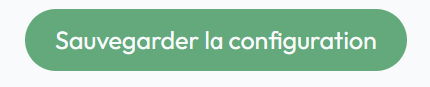
*Active save button (changes detected)*
   
2. **Disabled (gray)**: No changes
   - Button is not clickable
   - No changes to save

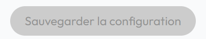
*Disabled save button (no changes)*

3. **In Progress (gray)**: Save in progress
   - Label: "Saving in progress..."
   - Button is not clickable

### Save Process

1. **Validation**: Color format verification
2. **Conversion**: Transform to YAML file
3. **Upload**: Send to server with images
4. **Confirmation**: Success or error message
5. **Reload**: Page automatically reloads after 200ms

### Feedback Messages

**Success**:
```
✓ Configuration updated successfully
```
- Green toast at the top of the screen
- Automatic page reload

**Color Error**:
```
✗ Invalid color for [field_name]
```
- Red toast at the top of the screen
- Save is cancelled

**Server Error**:
```
✗ Error updating configuration
```
- Red toast at the top of the screen
- Changes are not applied

---

## 6. Recommended Workflow

### Step 1: Planning
1. Define your color palette (use tools like [Coolors](https://coolors.co/))
2. Prepare your images with correct dimensions
3. Test contrasts for accessibility

### Step 2: Color Modification
1. Access the admin panel (`/admin`)
2. Modify the primary color first
3. Check the gradient preview
4. Adjust other colors accordingly
5. Ensure contrasts are sufficient

### Step 3: Image Modification
1. Upload the main logo
2. Check the preview
3. Upload other images if necessary
4. Verify dimensions are correct

### Step 4: Save and Verification
1. Click "Save Configuration"
2. Wait for confirmation message
3. Page reloads automatically
4. Verify all changes are applied
5. Test navigation in the application

---

## 7. Tips and Best Practices

### Colors

**Do**:
- Use colors with good contrast (minimum ratio 4.5:1)
- Test colors on different screens
- Keep consistency with your brand guidelines
- Use full hexadecimal format (8 characters)

**Don't**:
- Use colors too light for text
- Use too many different colors (stay consistent)
- Use flashy colors that tire the eyes
- Forget transparency in hex code

### Images

**Do**:
- Use SVG for logos and icons (better quality)
- Optimize image size (< 500 KB)
- Respect recommended dimensions
- Use images with transparent background for logos

**Don't**:
- Use images too heavy (> 2 MB)
- Use poor quality or pixelated images
- Use unsupported formats
- Use images with incorrect dimensions

### Accessibility

- **Contrast**: Verify text is readable on all backgrounds
- **Color Blindness**: Test your colors with color blindness simulators
- **Size**: Ensure icons are large enough (minimum 24x24px)

---

## 8. Troubleshooting

### Save button is disabled

**Cause**: No changes detected

**Solution**: Modify at least one field to enable the button

### "Invalid color" message

**Cause**: Incorrect color format

**Solution**: 
- Use `#RRGGBBAA` format (8 characters)
- Valid example: `#1dac78ff`
- Invalid example: `#1dac78` (missing transparency)

### Images don't display

**Cause**: Unsupported format or size

**Solution**:
- Check format (PNG, JPG, SVG)
- Reduce size if > 2 MB
- Check dimensions

### Changes are not applied

**Cause**: Browser cache

**Solution**:
1. Clear browser cache (Ctrl + Shift + R)
2. Or wait for automatic reload after save

### Save error

**Cause**: Server connection problem

**Solution**:
1. Check your internet connection
2. Verify backend server is active
3. Check server logs
4. Contact system administrator